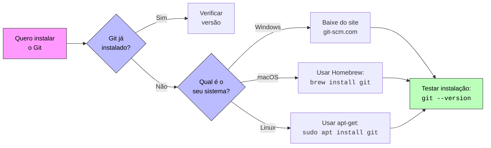

<!-- Título -->
# Instalando o Git

Este guia ensinará como instalar o Git, uma ferramenta importante para desenvolvedores, de forma simples e clara.

Vamos aprender como fazer isso em diferentes computadores, usando exemplos fáceis de entender.

***Conteúdo da Aula:***

## O que é Git?

Imagine que você está escrevendo um livro.

O Git é como ter um caderno mágico que:

* Guarda todas as suas alterações.
* Lembra quem fez cada mudança.
* Deixa você voltar para versões anteriores quando quiser.
* Ajuda várias pessoas a trabalhar no mesmo projeto ao mesmo tempo.

O **Git** é uma ferramenta multiplataforma, isto é, pode ser utilizada em qualquer sistema operacional (Windows, Linux ou macOS).

### Vocabulário Básico

* **Instalação** → Como colocar um novo jogo no seu computador.
* **Terminal/Prompt** → Uma janela onde você dá ordens para o computador.
* **Versão** → Qualquer número que indica qual é a edição atual do programa.
* **Verificação** → Checar se algo está funcionando corretamente.



O processo de instalação é simples, porém diferente entre os três sistemas operacionais. Abaixo estão as instruções por plataforma, além de verificações e configurações iniciais recomendadas.

## Instalação no Windows

Baixe o instalador Git para Windows em:

[Git for Windows](https://git-scm.com/download/win).

Na página, escolha o instalador compatível com a arquitetura do seu sistema(x86, x86 ou ARM) e faça o download.

Após o download, execute o instalador e siga o assistente de instalação até o fim. O instalador inclui o Git Bash, que é recomendado para iniciantes por oferecer um shell compatível com comandos Unix.

Para testar a instalação, abra o Prompt de Comando, PowerShell ou Git Bash e execute:

```powershell
git --version
```

Exemplo de saída esperada:

```code
git version X.Y.Z
```

Se você obter uma saída similar a essa, o Git está instalado e funcionando.

Dica útil (Windows):

* Para localizar o executável:
  * execute em PowerShell:
  
  ```powershell
  where git
  ```

## Instalação no Linux

Abra o terminal e utilize o gerenciador de pacotes da sua distribuição. Exemplos:

* Debian / Ubuntu:

```bash
sudo apt update
sudo apt install git -y
```

* Fedora:

```bash
sudo dnf install git -y
```

* Arch Linux / Manjaro:

```bash
sudo pacman -Syu git
```

Após a instalação, verifique se o Git foi instalado corretamente:

```bash
git --version
```

Exemplo de saída esperada:

```code
git version X.Y.Z
```

Para confirmar o caminho do binário:

```bash
which git
```

## Instalação no macOS

Existem várias formas de instalar o Git no macOS:

* via Homebrew,
* via Xcode Command Line Tools ou instalador oficial.

Usando Homebrew (recomendado para obter a versão mais recente):

```bash
brew install git
```

Se o Xcode Command Line Tools estiver instalado, pode já haver uma versão do Git disponível (mantida pela Apple), porém pode estar desatualizada.

Para instalar/atualizar as tools:

```bash
xcode-select --install
```

Após a instalação, verifique se o Git foi instalado corretamente:

```bash
git --version
```

Exemplo de saída esperada:

```code
git version X.Y.Z
```

Observação para Macs Apple Silicon (M1/M2): o Homebrew por padrão pode ser instalado em /opt/homebrew; garanta que esse caminho esteja no seu PATH.

### Após a instalação — configuração inicial obrigatória

Configure imediatamente seu nome e e-mail (essas informações aparecem nos commits):

```bash
git config --global user.name "Seu Nome"
git config --global user.email "seuemail@example.com"
```

Outras configurações úteis:

```bash
# Define editor padrão (ex.: VS Code).
git config --global core.editor "code --wait"

# Lista todas as configurações.
git config --list

```

### Verificações automáticas rápidas

Você pode rodar este script simples (bash) para verificar instalações e configurações básicas:

```bash
# Verifica versão.
git --version

# Verifica configurações essenciais.
git config --global user.name || echo "user.name não configurado"
git config --global user.email || echo "user.email não configurado"

# Localiza o executável.
which git || command -v git

# Verifica configuração do editor.
git config --global core.editor || echo "core.editor não configurado"
```

> No Windows `PowerShell`, substitua `which` por `where`.

<!-- Informações -->
## &#8505; Informações


&nbsp;

&nbsp;

&nbsp;

&nbsp;

&nbsp;

&nbsp;

